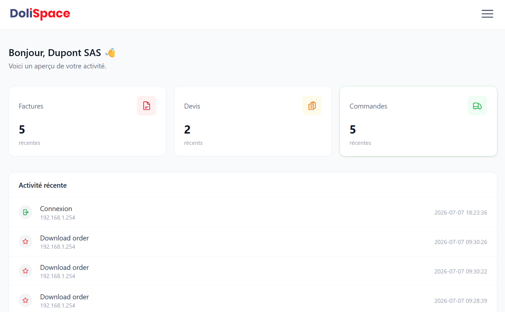
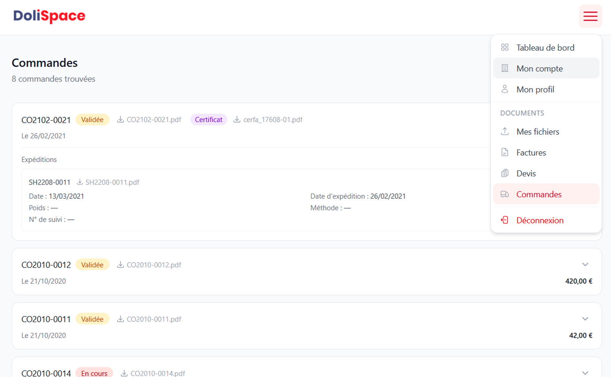

# Dolispace


A modern web customer portal allowing customers to view their quotes, orders, shipments, and invoices through an integration with the [Dolibarr](https://www.dolibarr.org) REST API.

The application manages its own user accounts: no account needs to be created or administered in Dolibarr. It never exposes Dolibarr directly and communicates exclusively through its REST API.

It can also be deployed on a server independent from the one hosting Dolibarr, providing better separation, security, and installation flexibility.

## Technical Stack

- [CodeIgniter 4](https://codeigniter.com) (PHP)
- SQLite (local database — users, logs, files, configuration)
- [Vite](https://vitejs.dev) + [Tailwind CSS v4](https://tailwindcss.com) + [Preline UI](https://preline.co)
- Dolibarr REST API for business data (third parties, orders, invoices, shipments)

## Features

- Passwordless login for new accounts (email verification + linking to a Dolibarr third party)
- Password + OTP login for existing accounts
- View quotes, orders, shipments, certificates, and invoices with PDF download
- Quotes, orders, invoices, shipments, and certificates can be individually enabled/disabled  
  (`admin/config` → "Features" card), automatically hidden if the corresponding Dolibarr module  
  is not detected
- File upload area
- Account management (email, password, contact details, intra-community VAT number verification via VIES)
- Administration interface: application configuration, user management (search, deletion), activity logs, uploaded files, Dolibarr API diagnostics, SMTP sending test, etc.

## Preview





## Requirements

- PHP 8.2+ with extensions: `intl`, `mbstring`, `sqlite3`, `curl`, `gd`, `fileinfo`
- Node.js + npm

## Installation

```bash
composer install
npm install
cp env .env
```

Edit `.env`: base URL, SQLite database connection, admin credentials.

```bash
php spark migrate --all
php spark db:seed DatabaseSeeder
npm run build
```

## Development

```bash
php spark serve
npm run dev
```

## Tests

```bash
composer install
vendor/bin/phpunit
```

## Deployment

See [DEPLOYMENT.md](DEPLOYMENT.md).

---

<p align="center">
  <a href="https://www.siladel.fr">
    
  </a>
</p>

<p align="center">
  Developed by <a href="https://www.siladel.fr">SILADEL</a> — Author: IGREJA David
</p>